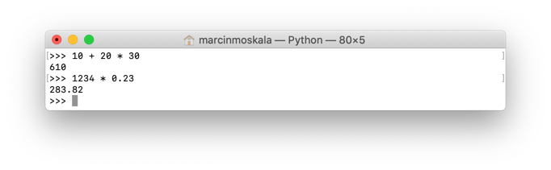

# Основні значення

У попередньому розділі ми навчилися писати код Python, який друкує "Привіт, світе":

```python
print("Привіт, світе")  # Привіт, світе
```

Дивлячись на нього, можна замислитись, чому текст виглядає так, а не інакше. Що таке `print`? Чому `Привіт, світе` у лапках? Із часом все проясниться. З `print` ми познайомимося, обговорюючи функції. А поки поговорімо про значення `"Hello, World"`.

## Тексти, відомі як рядки

Лапки використовуються для позначення текстового значення. В художніх книгах лапки часто показують, що дослівно подумав чи сказав герой. Так само і в програмуванні, де вони означають точне текстове значення.

```
# Письмо
"Привіт, світе"

# Python
print("Привіт, світе")  # Привіт, світе
```

Текст у лапках не інтерпретується, тому навіть якщо він містить якусь інструкцію, вона не буде виконуватися. Це значення, яке містить текст символ за символом. Ми можемо щось зробити з цим значенням, наприклад передати його до `print`. Хоча це, ймовірно, не має сенсу, ми так само могли би нічого з ним не робити.

```python
print(10)  # 10

# З’явиться значення, і з ним нічого не відбуватиметься
"print(10)"

print("print(10)")  # print(10)
```

### Рядки або стрінги

Текстові значення в програмуванні зазвичай іменуються **стрінгами**. Цей термін походить від англійського слова "string", яке означає стрічку або струну. Це свого роду послідовність знаків. Такі "стрічки" можуть мати різну довжину, їх можна з’єднувати, скорочувати, можна навіть вирізати невеликі фрагменти зсередини. Назва "string" увійшла у вжиток майже в усіх мовах програмування. Інколи також вживають терміни "стрічка" чи "ланцюжок", хоча насправді рідко хто так говорить. Програмісти використовують термін "стрінг" або "рядок" [^102_1], а оскільки мета цієї книги — передати практичні знання, я не відмовлятимуся від цієї назви.

### Лапки

У Python рядки можна створювати за допомогою подвійних `"` або одинарних `'` верхніх лапок.

{width: 90%}


Істотних відмінностей між ними немає. Існують лише певні умовності, які змушують програмістів в одних випадках віддавати перевагу одним, а в інших — іншим. У книзі я вирішив використовувати подвійні лапки `"`, які я вважаю більш інтуїтивними.

```python
print("Привіт, світе")  # Привіт, світе
print('Привіт, світе ')  # Привіт, світе
```

Знання про різні лапки може стати в нагоді, коли Тобі потрібно буде отримати текст із лапками. Якщо Ти хочеш відобразити в тексті одинарні лапки, візьми текст у подвійні. Якщо у тексті подвійні лапки, зовнішні мають бути одинарні.

```python
print("Let's play")  # Let's play
print('Сказав "Привіт"')  # Сказав "Привіт"
```

Текст, взятий у лапки, повинен бути в одному рядку. Якщо ми хочемо, аби текст містив кілька рядків, розділяємо їх знаком "\n". Можна сказати, що він позначає "Enter".

```python
text = "Line 1,\nLine2"
print(text)

# Виведе:
# Line 1
# Line 2
```

Ми також можемо поставити на початку і в кінці тексту три пари лапок (одинарних або подвійних). Тоді він може мати кілька рядків.

```python
text = """Line 1,
Line 2"""
print(text)

# Виведе:
# Line 1
# Line 2
```

### Додавання текстів

У різноманітних текстах ми можемо поєднувати цитати. Наприклад, ми могли би сказати:

```
# Письмо
Виведи "Привіт, " і "світе"
```

У програмуванні значення `"Привіт, "` і `"світе"` можна об’єднати знаком додавання `+`, який, розміщений між двома стрінгами, їх з’єднає:

```python
print("Привіт, " + "світе")  # Привіт, світе
```

{pagebreak}

### Вправа: Стрінги

Що буде виведено у представленому нижче коді?

```python
print('Хто "вона"?')
print("Використаю " + " для з’єднання текстів")
print("Текст," + "наступний," + "ще один")
```

Відповіді [в кінці книги](https://kt.academy/pl/article/py-rozwiazania).

## Числа

Число також є значенням. У Python ми працюємо з цілими (напр. `23`) та дійсними (напр., `23,5`) числами. Усі числа можуть бути від’ємними (з мінусом перед числом). Зверни увагу, що десяткова частина дійсних чисел пишеться після крапки, що відповідає правилам запису в англійській мові (напр., `3.14`, а не `3,14`).

```python
# Цілі числа
print(42)  # 42
print(-1)  # -1
# Дійсні числа
print(2.71)  # 2.71
print(-3.14)  # -3.14
```

З числами можна виконувати математичні дії. Python підтримує багато операцій, які деякі читачі можуть пам’ятати зі школи:

- Додавання `+`
- Віднімання `-`
- Множення `*`
- Ділення `/`
- Ділення без остачі `//`
- Остача від ділення `%`
- Піднесення до степеня `**`

```python
# Додавання
print(3 + 2)  # 5
print(10 + 8)  # 18
print(2 + 4)  # 6

# Віднімання
print(3 — 2)  # 1
print(10 — 8)  # 2
print(2 — 4)  # -2

# Множення
print(3 * 2)  # 6
print(10 * 8)  # 80
print(2 * 4)  # 8

# Ділення
print(3 / 2)  # 1.5
print(10 / 8)  # 1.25
print(2 / 4)  # 0.5

# Ділення без остачі
print(3 // 2)  # 1
print(10 // 8)  # 1
print(2 // 4)  # 0

# Остача від ділення
print(3 % 2)  # 1
print(10 % 8)  # 2
print(2 % 4)  # 2

# Піднесення до степеня
print(3 ** 2)  # 9
print(10 ** 8)  # 100000000
print(2 ** 4)  # 16
```

Важливо: якщо ми виконуємо операцію між двома цілими числами, результат також буде цілим числом. З іншого боку, якщо одне з цих чисел має дробову частину, тобто є дійсним числом, результат також буде дійсним числом.

```python
print(2 + 3)  # 5
print(2 + 3.0)  # 5.0
print(2.0 + 3)  # 5.0
print(2.0 + 3.0)  # 5.0
```

Python можна використовувати як калькулятор [img.png](resources/101_IDLE.png) навіть для обчислення результатів складних операцій. За замовчуванням у ньому зберігається правильна послідовність математичний дій, а також допускається використання дужок.

```python
print(1 + 2 * 3)  # 7
# (множення виконується перед додаванням)

print(1 + (2 * 3))  # 7
print((1 + 2) * 3)  # 9

print(1 ** 2 + 2 ** 2 + 3 ** 2 + 4 ** 2)  # 30
print(1 * 2 * 3 * 4 * 5)  # 120
print(1 * 2 + 3 * 4 + 5 * 6)  # 44
```

Тут варто пригадати попередній розділ, де ми навчилися використовувати REPL. Я не раз застосовував його як калькулятор.

{width: 70%}


### Вправа: Python як калькулятор

Використай Python REPL, щоб визначити, скільки буде:

- `1 * 2 + 3 * 4 + 5 * 6 + 7 * 8 + 9`
- `1 * (2 + 3) * (4 + 5) * (6 + 7) * (8 + 9)` (Чи відрізнятиметься цей результат від попереднього?)
- `1 * 2 / 3 * 4 / 5 * 6 / 7 * 8 / 9 * 10`  (Чи буде цей результат більшим за 1?)
- `2^{10}`$ <!-- можливо малось на увазі (być może, chodziło o) 2 ** 10? --> (Як думаєш, результат буде більшим чи меншим за 1000?)

Відповіді [в кінці книги](https://kt.academy/pl/article/py-rozwiazania).

## Логічні значення

Іншим важливим типом значень є **логічні**, тобто правда `True` і неправда `False`.

```python
print(True)  # True
print(False)  # False
```

Вони корисні у багатьох випадках. Наприклад, можуть вказувати, дав користувач згоду на збір даних (`True`), чи ні (`False`). У розділі про умови ми зможемо переконатися, що ці значення можуть вирішувати, чи виконувати певний фрагмент коду. Логічні значення дуже корисні та важливі, але звідки вони беруться?

## Оператор рівності та нерівності

Логічні значення найчастіше виникають в результаті порівняння двох інших значень. Для цього ми використовуємо оператор `==` (подвійний знак рівності), який повертає `True`, якщо значення однакові, і `False`, якщо вони відрізняються. Це буде працювати для вже відомих нам чисел і рядків.

```python
print(1 == 1)  # True
print(1 == 2)  # False

print("Marcin" == "Marcin")  # True
print("Marcin" == "Maciek")  # False
```

> Увага! Оператор `==`, який означає порівняння, не слід плутати з `=`, який ми розглянемо пізніше в книзі. Він означає присвоєння значення.

Також є оператор `!=`, який проводить перевірку, чи значення відрізняються. На практиці логічне значення, яке він повертає, завжди протилежне до того, яке повертає `==` (тобто якщо `==` повертає `True`, то `!=` повертає `False`, а якщо `==` повертає `False`, то `!=` повертає `True`).

```python
print(1 != 1)  # False
print(1 != 2)  # True

print("Marcin" != "Marcin")  # False
print("Marcin" != "Maciek")  # True
```

Ці оператори можна комбінувати з іншими відомими операціями:

```python
print("Привіт, " + "світе" == "Привіт, світе")  # True
print(1 + 2 == 3)  # True
print(1 + 2 != 3)  # False
```

Варто зазначити, що наведений вище код працює належним чином завдяки послідовності дій. Порівняння `==` і `!=` виконується після арифметичних операторів. Щоб розрахувати `3 == 1 + 2`, спочатку виконується операція додавання `1 + 2`, а вже потім порівняння `3 == 3`, яка повертає результат `True`.

> Важливо знати, що знак рівності в програмуванні має дещо інше значення, ніж знак рівності в шкільній математиці. Коли ми на уроках математики бачили, що `х * 2 = 4`, ми припускали, що рівняння має бути виконано, отже `x` має дорівнювати 2. У програмуванні ми перевіряємо, виконується воно чи ні. Якщо `x` дорівнюватиме, наприклад, `3`, рівняння `х * 2 == 4` поверне `False`.

## Оператори порівняння чисел

Іноді може знадобитися перевірити, чи одне значення більше за інше. Для цього ми використовуємо оператори порівняння[^102_2]:

- `>`, який перевіряє, чи значення ліворуч **більше** від того, що праворуч;
- `<`, який перевіряє, чи значення ліворуч **менше** від того, що праворуч;
- `>=`, який перевіряє, чи значення ліворуч **більше або дорівнює** тому, що праворуч;
- `<=`, який перевіряє, чи значення ліворуч **менше або дорівнює** тому, що праворуч.

```python
print(1 > 3)  # False
print(1 < 3)  # True

print(2 > 3)  # False
print(3 > 3)  # False
print(4 > 3)  # True

print(2 < 3)  # True
print(3 < 3)  # False
print(4 < 3)  # False

print(2 >= 3)  # False
print(3 >= 3)  # True
print(4 >= 3)  # True

print(2 <= 3)  # True
print(3 <= 3)  # True
print(4 <= 3)  # False
```

### Вправа: Python як калькулятор порівняння

Використай Python, щоб дізнатися, що більше:

- `1 * 2 + 3 * 4 + 5`  чи `1 + 2 * 3 + 4 * 5`?
- `2^{20}`$ чи `3^{15}`$ <!-- можливо треба (być może, trzeba) 2 ** 20 чи 3 ** 15? -->?
- `2^{15}`$ чи `10^4`$ <!-- можливо треба (być może, trzeba) 2 ** 15 чи 10 ** 4? -->?

Відповіді [в кінці книги](https://kt.academy/pl/article/py-rozwiazania).

## Типи значень

У цьому розділі ми розглянули деякі основні типи значень. Ми вивчили цілі та дійсні числа, стрінги, логічні значення. Кожен із цих типів ніби з іншого світу, а кажучи мовою математики — "з іншого простору". У програмуванні кожне значення має свій тип, який визначає, з якого простору це значення походить. Вони мають свої назви:

- Стрінги (тексти) мають тип `str`[^102_3].
- Цілі числа (без дробової частини) мають тип `int`[^102_4].
- Дійсні числа (з дробовою частиною) мають тип `float`[^102_5].
- Логічні вирази (`True` і `False`) мають тип `bool`[^102_6].

Ти можеш перевірити тип значення за допомогою функції `type`:

```python
print(type(""))  # <type 'str'>
print(type("Some text"))  # <type 'str'>
print(type("Text " + "another"))  # <type 'str'>

print(type(10))  # <type 'int'>
print(type(0))  # <type 'int'>
print(type(-10))  # <type 'int'>

print(type(0.1))  # <type 'float'>
print(type(3.14))  # <type 'float'>
print(type(42.0))  # <type 'float'>

print(type(True))  # <type 'bool'>
print(type(False))  # <type 'bool'>
print(type((1 > 2)))  # <type 'bool'>
```

Крім них, Python також підтримує багато інших типів. Додатково можна встановлювати власні типи. Ми побачимо це в наступних частинах книги.

Спокійно, все по черзі. В наступних розділах ми дізнаємося про ці типи значень і про те, як вони використовуються у програмуванні. Знайомлячись із наступними блоками, ми зможемо виконувати з ними все більше й більше операцій і нарешті використаємо їх для написання власної гри. Готові? Вперед! Час познайомитися зі змінними.

[^102_1]: Філологи часто цим незадоволені, але я виявив, що програмістам думка філологів доволі байдужа.
[^102_2]: Формально `==` і `!=` також належать до операторів порівняння. Однак я не знайшов слова, яке би визначало виключно `<`, `>`, `<=` і `>=`. Я також уникав поняття оператора нерівності, оскільки в програмуванні воно сильно асоціюється з `!=`.
[^102_3]: `str` — скорочення від "string".
[^102_4]: `int` — скорочення від "integer", англ. "ціле число".
[^102_5]: назва "float" стосується того, як дійсні числа кодуються в програмуванні.
[^102_6]: Назва цього типу походить від прізвища математика Джорджа Буля, який ввів у логіку алгебраїчні методи, створивши т.зв. Булеву алгебру. Вона трактує `True` і `False` як значення та визначає різні операції, такі як *і*, *або* чи *ні*.


